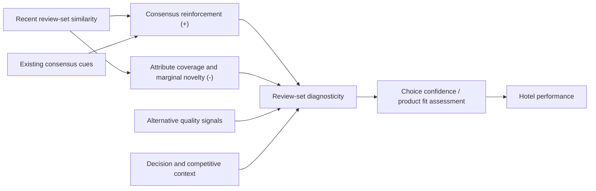

# Review Similarity–Revenue 论文重新定位与理论框架方案

> 版本：2026-08-03  
> 依据：`outputs/paper/reviewsimi-revenue-0723v1.docx`、`../Shen_Manuscript_Draft_1121.docx`，以及已核实的公开调查和学术文献。  
> 目标读者：Hospitality 研究者，以及 IS 中关注 consumer decision support / decision analysis 的读者。

## 1. 核心判断

这篇论文不宜继续以“以往只研究单条评论，我们首次研究评论之间的关系”为主要 gap。团队已经发表的 Journal of Retailing 论文直接研究了相邻评论的内容相似性、helpfulness 和 perceived uniqueness；外部文献也已经开始讨论评论相对于前序信息的 similarity/dissimilarity。因此，新论文必须从“发现一个新的文本特征”升级为“解释评论集合的结构如何转化为企业绩效”。

推荐的中心问题是：

> **当近期评论彼此相似时，它们究竟是在形成有价值的共识，还是在重复已有信息、降低评论集合的决策价值？这种 review-set structure 何时会进一步影响酒店经营绩效？**

推荐的一句话 position：

> 本文将近期评论视为一个共同参与消费者决策的 **review set**，提出评论相似性同时蕴含“共识强化”和“信息覆盖收缩”两种相反含义；酒店面板结果表明，在住宿决策中，内容重复所造成的边际信息损失总体超过共识收益，并且这一损失会随既有共识线索、替代质量信号和决策环境而系统变化。

这比旧稿的 position 更强，原因有三点：

1. 它建立了真正的理论 tension，而不是仅报告一个尚未研究的文本指标。
2. 它能够统一解释高评论量、低评分离散度、低星级、独立酒店、局部竞争、低情绪和 COVID 等新结果。
3. 它与团队已发表论文构成“微观信息评价 → 市场绩效后果”的研究议程，而不是重复同一项贡献。

## 2. 现实动机：公开调查应如何使用

公开调查只用于说明研究问题具有现实重要性，以及消费者面对的是一个“近期评论集合”而非单条评论；不能用来证明本文的心理机制。

### 2.1 可用于 Introduction 的事实

- Tripadvisor 与 Ipsos MORI 对 12 个市场的 23,292 名用户进行调查，81% 的受访者表示会在预订住宿前经常或总是阅读评论；78% 特别关注最新评论；55% 会跨多个页面阅读多条评论，平均在酒店或餐厅决策前阅读 9 条评论。这组事实直接支持本文的“recent review set”决策场景。[Tripadvisor & Ipsos MORI, 2019](https://ir.tripadvisor.com/news-releases/news-release-details/online-reviews-remain-trusted-source-information-when-booking)
- 同一调查中，70% 的用户将描述性、helpful 的评论列为使用 Tripadvisor 的主要原因，62% 看重内容的广泛性；这说明消费者不仅需要评分共识，也需要具体且覆盖面广的文本信息。[Tripadvisor & Ipsos MORI, 2019](https://ir.tripadvisor.com/news-releases/news-release-details/online-reviews-remain-trusted-source-information-when-booking)
- Tripadvisor 对五个国家约 9,000 名消费者的调查显示，76% 的旅行者偏好住宿场景中的长文本评论；他们关注清洁、位置、价值、房间、服务和设施等不同属性。这可用于说明酒店是一种多属性体验产品，评论集合的属性覆盖具有决策价值。[Tripadvisor hotel shopper survey](https://www.tripadvisor.com/business/insights/hotels/resources/hotel-shoppers-look-for-reviews)
- YouGov 2024 年覆盖 17 个市场的调查显示，42% 的消费者在选择住宿时更依赖其他消费者的评论，只有 5% 更依赖专业评论，33% 同等依赖两者。这可以作为 peer-generated information 在酒店选择中的现实地位证据。[YouGov, 2024](https://yougov.com/articles/49462-peers-over-pros-more-travellers-rely-on-consumer-feedback-than-critic-reviews-for-accommodation)
- Tripadvisor 针对 95,608 名旅行者和 7,215 名酒店业经营者的早期调查将“及时、具体、包含个人独特经历和事实细节”列为有用评论的重要特征。这可以辅助引出“重复评论未必继续增加信息”的现实问题。[Tripadvisor helpful-review survey](https://www.tripadvisor.com/TripAdvisorInsights/w753)

### 2.2 建议的现实动机段落逻辑

不要堆砌“多少消费者看评论”的统计数字。建议只保留以下三步：

1. **评论不可缺少**：消费者高度依赖 peer reviews 做住宿选择。
2. **消费者阅读一个近期集合**：他们关注最新内容并连续阅读多条评论。
3. **数量不等于信息**：当多条评论反复讨论相同经历时，消费者虽然看见更多文本，却未必获得更多可用于比较、判断和匹配的信息。

由此提出实际决策问题：平台和酒店不仅需要积累评论，还需要理解近期评论集合提供了多少非重复信息。

## 3. 与团队 Journal of Retailing 论文的边界

团队论文 *Standing Out from Adjacent Reviews: How Content Similarity Affects Review Helpfulness* 使用 TripAdvisor 评论、Doc2Vec 和实验，研究相邻评论相似性如何通过 perceived uniqueness 影响单条评论的 helpfulness。[Gao et al., 2026](https://doi.org/10.1016/j.jretai.2026.02.005)

两篇论文应被写成同一研究议程中的互补层级：

| 维度 | Journal of Retailing 论文 | 当前 Revenue 论文 |
|---|---|---|
| 分析单位 | focal review 及其相邻评论 | hotel-month 的近期可见评论集合 |
| 核心问题 | 一条评论在局部序列中是否显得独特、helpful | 整个近期评论集合是否提供足够的非重复决策信息 |
| 主要结果变量 | perceived helpfulness | 酒店 RevPAR / 经营绩效 |
| 理论重点 | local redundancy、perceived uniqueness | consensus–coverage trade-off、review-set diagnosticity、经济后果 |
| 识别与证据 | 大规模评论数据 + controlled experiments | 评论—收入匹配面板、FE、Sys-GMM、替代测量和情境边界 |
| 管理问题 | 如何排序与呈现评论 | 评论集合结构是否具有可衡量的经营价值，以及何时更重要 |

### 必须遵守的写作边界

- 当前论文应在 Introduction 和 Literature Review 中主动引用团队 Journal of Retailing 论文。
- 不再声称“首次发现评论相似性”“首次研究相邻评论”或“首次证明相似评论降低 helpfulness”。
- 可以声称的增量是：将局部 review-level information evaluation 推进到 **review-set configuration 的 firm-performance consequences**，并识别其市场、酒店和信息环境边界。
- 不应把 Journal of Retailing 论文中的实验当作当前数据内部的 mediation test。更准确的写法是：该论文为“相似性降低独特性”的微观过程提供独立证据，当前论文进一步检验这一信息结构是否具有下游经济后果。
- 投稿前需要专门披露两篇论文是否共享原始 TripAdvisor 评论、时间区间或文本向量；在附录或 cover letter 中清楚解释样本、构念、因变量和研究问题的非重叠部分，避免被理解为 salami slicing。

## 4. 文献对话与论文位置

### Stream 1：Aggregate review signals 与酒店绩效

这类研究把评论集合压缩为 rating valence、volume、variance、positive/negative volume 等数值信号，并检验其对销量、酒店收入或增长的影响。代表性工作包括 eWOM–sales meta-analysis，以及酒店品牌、评论与增长之间的动态关系。

- 该 stream 的基本观点：评论集合可以通过总量、平均评价和离散程度形成质量与流行度信号。
- 局限：即使 volume 和 rating 完全相同，两组评论也可能在语义内容的重复程度和属性覆盖上存在巨大差异。
- 本文对话方式：不是否定 aggregate signals，而是解释当这些信号已经提供“多少人评论、总体评价如何、评价是否一致”之后，文本集合还提供多少增量信息。

可重点引用：[Babić Rosario et al., 2016](https://doi.org/10.1509/jmr.14.0380)；[Ding, Gao, & Liu, 2022](https://doi.org/10.1016/j.dss.2021.113649)。

### Stream 2：Individual review content 与信息价值

该 stream 研究 sentiment、readability、informativeness、narrativity、emotion、comparative expressions 等单条或聚合文本特征如何影响 helpfulness、选择或销量。

- 该 stream 的基本观点：文本的信息质量、说服方式和表达内容会影响消费者判断。
- 局限：许多研究仍把文本特征看成 review-intrinsic property，较少讨论一条信息加入现有评论集合后还能增加多少新信息。
- 本文对话方式：把关注点从“评论本身写得好不好”转向“评论集合共同构成怎样的决策支持环境”。

竞争情境下 review narrativity 对销量的影响可作为 hospitality/OM 侧的重要邻近工作：[Mukhopadhyay et al., 2022](https://doi.org/10.1111/poms.13698)。

### Stream 3：Cross-review context、concordance 与 redundancy

这一 stream 已经出现两种相反观点，正是本文 tension 的来源。

**观点 A：一致与相似可以有价值。** 当多条评论或 top reviews 与总体评论信号一致时，信息更容易被处理，也可能显得更可信。Jabr 与 Rahman 发现，top-review signal 得到其他评论重申时，其影响会增强。[Jabr & Rahman, 2022](https://doi.org/10.25300/MISQ/2022/16169)

**观点 B：差异与新颖可以有价值。** 团队 Journal of Retailing 论文发现，相邻内容越相似，单条评论越不 helpful，机制是 perceived uniqueness 下降。[Gao et al., 2026](https://doi.org/10.1016/j.jretai.2026.02.005)

**进一步的复杂性：similarity 并非单一维度。** 2025 年 Journal of Business Research 的研究发现，消费者偏好与既有信息 topic 对齐、但 lexical expression 不重复的评论。这说明“共识”与“新信息”可以同时存在，也说明本文不宜简单宣称 diversity 永远优于 similarity。[Wang et al., 2025](https://doi.org/10.1016/j.jbusres.2024.115068)

### 本文在三条 stream 之间的位置

本文不再以“cross-review relations 尚未被研究”为 gap，而是提出尚未解决的下游问题：

> 已有研究开始说明相似性如何影响单条评论的 perceived helpfulness，但尚不清楚一个酒店近期评论集合的整体相似结构是否会形成可观察的经营后果，也不清楚这种后果如何随既有共识线索、替代质量信号和选择环境变化。

## 5. 推荐理论框架：Consensus–Coverage Trade-off

### 5.1 核心构念

建议将理论构念统一称为 **recent review-set similarity**；实证变量仍可保留 ARS（average review similarity）的名称。这样可以明确：

- 概念单位是一个近期可见 review set；
- 测量方式是集合内评论向量两两相似性的平均值；
- 它不同于某条 focal review 与相邻评论之间的 adjacency-based similarity。

### 5.2 两种相反的信息含义

1. **Consensus reinforcement**：相似评论可能表明不同消费者对酒店形成一致判断，从而提高可信度、处理流畅性或社会证明。
2. **Coverage loss**：相似评论也意味着后续文本更少补充新属性、新经历和新适用情境，因而降低评论集合的边际信息增益。
3. **净效应**：本文的负向主效应说明，在当前酒店决策场景中，coverage loss / redundancy cost 平均超过 consensus benefit。

“review-set diagnosticity”在当前论文中应作为理论机制或解释性中介，而不是已被直接测量的变量。措辞应使用 “consistent with”“suggests” 或 “we theorize”，避免写成已经被数据直接识别的 mediation。

### 5.3 为什么酒店场景尤其合适

酒店是多属性、体验性且适配性较强的产品。消费者不仅判断抽象质量，还需要了解清洁、位置、房间、服务、设施、氛围和价值等维度是否适合自己。重复评价同一属性可能强化共识，但无法替代跨属性和跨经历的信息覆盖。因此，review-set structure 对酒店 choice support 具有直接意义。

## 6. 假设与结果的重新组织

不建议把现有所有分组结果扩展成 8–10 个并列 hypotheses。当前最优结构是“一项主效应 + 两组理论边界 + 三类情境扩展”。

### H1：Review-set similarity 的平均净效应

> **H1：Recent review-set similarity negatively affects hotel performance.**

逻辑：相似性虽然能够提供共识，但也降低近期评论集合的属性覆盖与边际新信息；对需要比较和匹配多属性体验的酒店消费者，后者平均占主导。

证据：FE、Sys-GMM 和 OLS 中 ARS 均为负；替代滞后、滚动窗口和 JSD 测量方向一致；使用 5–20 条评论构造时结果稳定，扩大至 30 条以上后精度下降。

### H2：既有共识线索与“重复信息折旧”

> **H2：当评论环境已经提供更充分的共识线索时，recent review-set similarity 的负向绩效作用更强。**

主要经验对应：

- 高累计评论量组更负，组间差异 `p = .050`；
- 高近期评论量组更负，组间差异 `p = .008`；
- 低累计评分离散度组更负，组间差异 `p = .050`；
- 累计平均评分本身不是稳定边界，`p = .110`。

解释：volume 和 rating agreement 已经向消费者提供“很多人评价且大体一致”的共识信号。在这一情境下，文本再度重复同样内容的边际价值更低；消费者更需要新增属性或使用场景信息，而不是更多相同表达。

这一组是当前最适合作为核心 moderation story 的结果，因为 high recent volume 的组间证据最强，而且 volume、dispersion 和 review-set redundancy 在理论上属于同一信息环境。

### H3：替代质量信号与对文本集合的依赖

> **H3：当酒店缺少有力的非文本质量信号时，recent review-set similarity 的负向绩效作用更强。**

主要经验对应：

- 低星级酒店更负，组间差异 `p = .064`；
- 独立酒店更负，组间差异 `p = .070`；
- 平台排名较弱的酒店更负，组间差异 `p = .056`；
- Traveler’s Choice 组间差异不显著。

解释：品牌、星级和平台地位可以作为外部质量线索。当这些线索较弱时，消费者更依赖评论文本来理解具体体验并判断 fit；如果近期文本高度相似，缺失信息就更难由其他信号弥补。

注意：这组结果大多为边际显著，应该呈现为一个理论一致的证据组合，而不是逐项宣称强 moderation。正文应报告 exact p-values，并明确其支持程度弱于 H2。

### 情境扩展 A：局部竞争和比较需求

- ZIP 层面竞争者 RevPAR 分组差异约 `p = .056`；
- ZIP HHI 连续交互显著为正，说明集中度提高、竞争减弱时 ARS 的负向边际效应减弱；
- City 层面的分组和交互不显著。

解释：评论集合的非重复信息在消费者进行局部酒店比较时更有价值。ZIP 比 City 更接近实际 choice set，因此结果应被定位为“decision-relevant market boundary”，而不只是一般竞争效应。

### 情境扩展 B：属性复杂度和负面共识

- 设施较多酒店中 ARS 更负，组间差异约 `p = .066`：产品属性空间越大，重复评论造成的 coverage loss 越明显。
- 低净正向情绪组中 ARS 更负，组间差异 `p = .048`：高度相似的负面内容可能同时意味着重复信息和 recurring-problem consensus，因而对绩效更不利。
- functional/experiential 分类虽然组间差异显著，但变量构造争议大且方向难以与团队 Journal of Retailing 论文协调，建议按当前结果文档的备注从主文删除，至多留在附录并充分说明构造。

### 情境扩展 C：COVID 作为 decision-regime shock

COVID 期间 ARS 负效应明显减弱甚至消失。推荐解释是：当旅行限制、健康风险和宏观需求冲击主导决策时，评论集合的属性覆盖不再是主要约束，文本结构的边际决策价值下降。

COVID 不宜被写成普通 moderator hypothesis。它更适合作为对理论边界的 regime-shift test：只有当消费者能够根据酒店信息进行有意义的比较和选择时，review-set diagnosticity 才会转化为绩效。

## 7. 推荐 contributions

正文只保留三项贡献，并按以下顺序写。

### Contribution 1：从 review-level utility 推进到 review-set economic value

已有研究，包括团队 Journal of Retailing 论文，解释了单条评论在上下文中何时更 helpful。本文进一步说明，近期评论集合的关系结构不仅改变信息评价，还会与真实酒店收入相联系。贡献不是“首次研究相似性”，而是揭示 **review-set configuration 的 downstream economic consequence**。

### Contribution 2：提出并经验化 consensus–coverage trade-off

现有文献分别强调一致信号的可信度和差异信息的独特价值。本文把二者放入同一框架：相似性既可能强化共识，也可能压缩属性覆盖。高评论量、低评分离散度和低情绪等结果进一步表明，相似性的价值取决于它是在补充共识，还是只是在复制已经存在的共识。

### Contribution 3：把评论信息价值放入 hospitality choice environment

本文显示，review-set similarity 的绩效后果受替代质量信号、局部 choice-set competition、产品属性复杂度和宏观决策 regime 影响。这使评论文本研究从一般 content effect 推进到一个 context-sensitive decision-support explanation，并为酒店平台的 review curation 提供依据。

### 不建议继续使用的 contribution 表述

- “首次把评论看作相互关联的信息”——已被团队论文和外部文献覆盖。
- “扩展 signaling theory、relationship capital 和 herd behavior”——理论过多但没有分别得到识别，容易显得是拼盘。
- “发现三个新的 moderators”——新结果已经变化，而且大量分组差异只在 5%–10% 水平。
- “证明消费者通过某心理机制做出选择”——当前论文没有直接的消费者过程测量。

## 8. Introduction 的推荐五段结构

### Paragraph 1：现实决策场景

用 Tripadvisor/Ipsos 的 81%、78%、55% 和平均 9 条评论说明消费者在住宿选择中依赖一个近期评论集合。不要从 rating inflation 开篇；rating inflation 可以作为背景，但不足以产生当前论文的核心 tension。

### Paragraph 2：现实 puzzle

提出“更多评论是否真的等于更多信息”。相似评论可能形成可信共识，也可能只是重复相同属性与经历。对酒店这种多属性体验产品，两种解释都合理，因此净绩效后果并不显然。

### Paragraph 3：文献 tension 与未解问题

先承认 aggregate-signal、individual-content 和 cross-review-context 三条文献已经取得的进展，包括团队 Journal of Retailing 论文；随后把 gap 收窄为 review-set structure 的 firm-level economic consequence 与 context dependence。

### Paragraph 4：研究设计与核心发现

简洁介绍 TripAdvisor 评论、Texas 酒店收入、hotel-month panel、Doc2Vec、近期可见 review set、FE/Sys-GMM 和替代测量。结果只强调：稳定负主效应、existing-consensus 边界、alternative-signal 边界和局部 decision context。

### Paragraph 5：三项贡献

按“经济后果—理论 trade-off—hospitality decision context”的顺序写，避免列举所有异质性结果。

## 9. Literature Review 与 Discussion 的重构

### Literature Review

建议由旧稿的“online reviews and product demand + 三个零散 moderator”改成：

1. **Aggregate Review Signals and Hotel Performance**  
   交代 rating、volume、variance、valence/sentiment 如何提供共识或质量信号。
2. **From Review Content to Review-Set Structure**  
   从 sentiment、informativeness、narrativity 过渡到 contextual/adjacent review research，并明确引用团队论文。
3. **Consensus–Coverage Trade-off**  
   同时推导共识收益和覆盖损失，说明酒店情境下为何预计净效应为负。
4. **When Redundancy Costs More**  
   只正式发展 existing consensus cues 和 alternative quality signals 两组边界；竞争、情绪、设施与 COVID 放入 extensions。

### Discussion

Discussion 不应逐表复述结果。建议按以下顺序：

1. **Net effect**：在酒店近期评论集合中，coverage loss 平均超过 consensus benefit。
2. **Why volume and agreement matter**：共识已由数量和评分一致性提供时，重复文本发生信息折旧。
3. **Why weak-signal hotels matter**：低星级、独立、低排名酒店缺少替代信号，更依赖非重复文本。
4. **Decision context**：ZIP 而非 City、设施复杂度、低情绪和 COVID 共同说明该效应取决于实际 choice environment。
5. **Connection to sister paper**：从 perceived uniqueness/helpfulness 延伸到 review-set economic value，但明确当前研究没有直接再检验心理中介。

## 10. 论文标题备选

推荐优先级如下：

1. **When More Reviews Say the Same Thing: Recent Review-Set Similarity and Hotel Performance**
2. **Consensus or Redundancy? The Performance Consequences of Similarity Within Recent Review Sets**
3. **Beyond Review Volume: How the Information Structure of Recent Reviews Shapes Hotel Performance**
4. **The Economic Cost of Redundant Reviews: Evidence from Hotel Review Sets and Revenue**

标题 1 最适合 Hospitality 与 Decision Support 双重读者：问题直观、构念明确，也不会与团队 Journal of Retailing 论文的 “Standing Out” 标题过度接近。

## 11. 执行计划

### Phase 1：锁定 construct 与跨论文边界

- 统一使用 recent review-set similarity；定义 ARS 是其集合内平均相似度测量。
- 制作两篇团队论文的数据、样本、测量、结果变量和贡献对照表。
- 删除所有“first cross-review study”式 novelty 声明。

### Phase 2：重建文献矩阵

- 按 aggregate signals、individual content、cross-review context、hospitality performance 四组整理文献。
- 每篇文献记录 construct、unit of analysis、outcome、mechanism、与本文关系。
- 将支持 consensus 的论文和支持 novelty/coverage 的论文并列，而不是只寻找支持负效应的证据。

### Phase 3：重写前端理论

- 先重写 Introduction 五段和 Literature Review 四节。
- 只保留 H1、existing-consensus boundary 和 alternative-signal boundary 三个主理论模块。
- 将 competition、amenities、sentiment 和 COVID 降为 context extensions。

### Phase 4：结果—理论对齐

- 主结果表中优先呈现 FE、Sys-GMM、替代相似度和 5–20 review scopes。
- 异质性结果分为 confirmatory、supportive 和 exploratory 三层，始终报告 exact p-values。
- 累计 rating、City competition 和 Travelers’ Choice 的 null results 应主动报告，用于界定理论边界。
- 删除或附录化 functional/experiential 结果。

### Phase 5：重写 Discussion 与 contributions

- 以 consensus–coverage trade-off 解释结果，不再并列 signaling、relationship capital、herding 和 dual-process 四套理论。
- 明确当前数据支持的是绩效关联、稳健性和边界，不是心理 mediation。
- 将团队 Journal of Retailing 论文作为微观过程基础，并清楚说明本文的宏观经济增量。

### Phase 6：投稿前审计

- 检查两篇团队论文是否存在样本、文字、图表或理论段落重叠。
- 准备一段 cross-paper disclosure 和 cover-letter explanation。
- 做 claim–evidence audit：所有理论陈述有文献，所有结果陈述与 0723 表格一致，所有公开调查注明样本和来源。

## 12. 完成标准

重写后的论文前端应达到以下状态：

- 读者能在 Introduction 第二段看到明确的“共识还是冗余”冲突。
- 读者不会把本文误认为 Journal of Retailing 论文的 revenue extension 或重复发表。
- 所有主要异质性都能归入 existing consensus、alternative signals 或 decision context，而不是一串零散 moderators。
- contributions 只包含当前研究真正识别的 review-set economic value、trade-off 和 hospitality decision context。
- 公开调查只承担现实动机功能，学术文献承担理论推导功能，0723 结果承担经验检验功能。

## 13. 优先参考文献与资料

### Academic literature

- Babić Rosario, A., Sotgiu, F., De Valck, K., & Bijmolt, T. H. A. (2016). The effect of electronic word of mouth on sales: A meta-analytic review of platform, product, and metric factors. *Journal of Marketing Research, 53*(3), 297–318. <https://doi.org/10.1509/jmr.14.0380>
- Ding, X., Gao, B., & Liu, S. (2022). Understanding the interplay between online reviews and growth of independent and branded hotels. *Decision Support Systems, 152*, 113649. <https://doi.org/10.1016/j.dss.2021.113649>
- Gao, B., Wang, J., Liu, S., & Cui, N. (2026). Standing out from adjacent reviews: How content similarity affects review helpfulness. *Journal of Retailing*. <https://doi.org/10.1016/j.jretai.2026.02.005>
- Jabr, W., & Rahman, M. S. (2022). Online reviews and information overload: The role of selective, parsimonious, and concordant top reviews. *MIS Quarterly, 46*(3), 1517–1550. <https://doi.org/10.25300/MISQ/2022/16169>
- Mukhopadhyay, S., Kumar, V., Sharma, A., & Chung, T. S. (2022). Impact of review narrativity on sales in a competitive environment. *Production and Operations Management, 31*(6), 2538–2556. <https://doi.org/10.1111/poms.13698>
- Wang, S., Karmakar, S., Wang, F., & Pei, Y. (2025). Content dissimilarity and online review helpfulness: Contextual insights. *Journal of Business Research, 187*, 115068. <https://doi.org/10.1016/j.jbusres.2024.115068>

### Public survey and industry evidence

- Tripadvisor & Ipsos MORI (2019), *The Power of Reviews*: <https://ir.tripadvisor.com/news-releases/news-release-details/online-reviews-remain-trusted-source-information-when-booking>
- Tripadvisor, *What Hotel Shoppers Look for in Reviews*: <https://www.tripadvisor.com/business/insights/hotels/resources/hotel-shoppers-look-for-reviews>
- Tripadvisor, *Research: What Makes a Helpful Review*: <https://www.tripadvisor.com/TripAdvisorInsights/w753>
- YouGov (2024), *Peers over Pros*: <https://yougov.com/articles/49462-peers-over-pros-more-travellers-rely-on-consumer-feedback-than-critic-reviews-for-accommodation>

