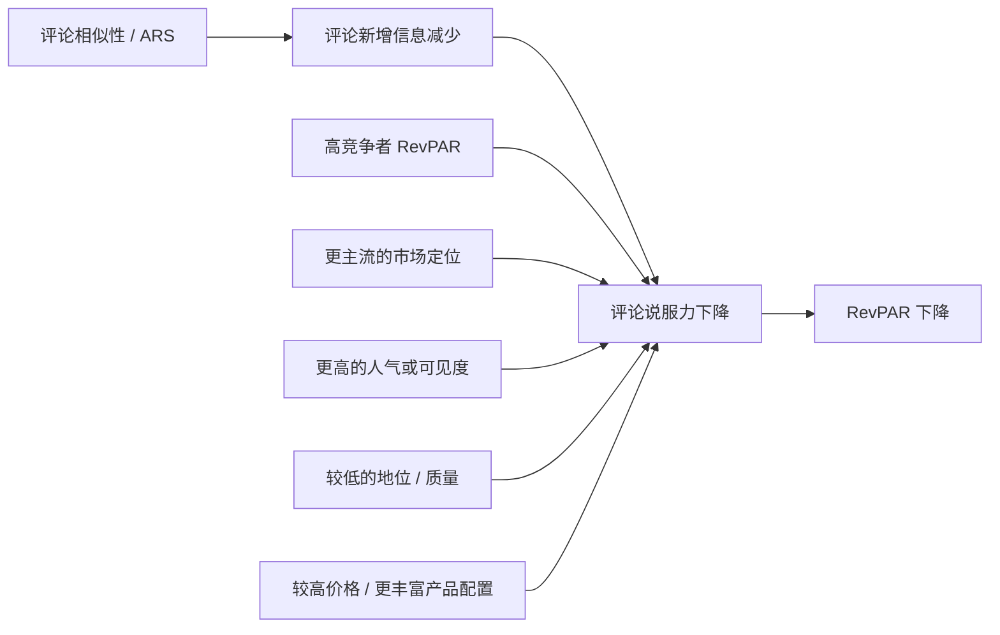
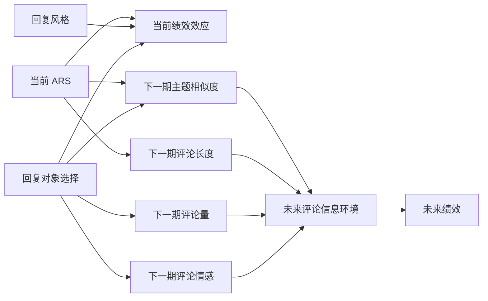

# 结果备忘录 0606

## 一、范围与依据

本备忘录是在 `paper-results-0605.md` 工作笔记基础上整理出的结构化结果记录。它将手工记录的结果解读，与当前仍在使用的 Route A / Route B Stata 脚本结合起来，形成一份更规范的研究结果摘要。

当前主要依据的脚本包括：

- `run_routeA_market_boundaries_260605.do`
- `run_routeA_organization_boundaries_260605.do`
- `run_routeA_product_systematics_260605.do`
- `run_routeA_review_environment_260605.do`
- `run_routeB_engagement_style_260605.do`
- `run_routeB_learning_effect_260606.do`
- `run_routeB_mr_targeting_260605.do`

本备忘录对证据强弱采用如下口径：

- `强`：正式交互项显著，且分组回归方向一致。
- `提示性`：分组回归呈现出有经济意义的差异，但正式交互证据较弱或不稳定。
- `弱`：方向上有一定兴趣，但统计支持有限，或不同检验之间不一致。

数据与记录层面的说明：

- 当前工作笔记中仍保留了一些历史编号、重复标签、以及不同版本脚本之间的残留表述，尤其集中在 Route B。
- 本备忘录在能够由当前 `do` 文件明确识别时，以当前脚本口径为准。
- 若工作笔记与当前脚本之间存在轻微不一致，本备忘录优先采用当前脚本，并将旧结果仅视为提示性证据。

## 二、路径一：ARS 作为主效应

### 2.1 核心判断

Route A 的基础结论已经较为稳定：更高的评论相似性（`sim_mean` / ARS）与更低的酒店绩效（`ln_RevPAR_clean`）相关。换言之，当前的核心问题已经不再是“ARS 是否为负”，而是“在什么样的市场、产品、评论环境与酒店特征下，这一负效应更强或更弱”。

### 2.2 市场边界结果

| 模型 | 调节变量定义 | 主要经验结果 | 经济含义 | 证据强度 |
|---|---|---|---|---|
| M0.1 | 市场边界样本下的基准回归 | `sim_mean = -0.1570`, `p = 0.007` | 在 `focus100` 市场边界样本中，ARS 与 RevPAR 显著负相关。 | 强 |
| M0.2 | `ln_avg_com_RevPAR`，可理解为周边竞争者整体绩效水平 | 交互项显著为负；高竞争价值组中 grouped slope 更负 | 当周边竞争者处于更高 RevPAR 水平时，评论相似性的代价更大。 | 强 |
| M1 / M3 | `zip_n_full`，ZIP 层面的竞争者数量，分别用分组 dummy 与连续变量表达 | 正式交互较弱；高 ZIP 竞争组中 grouped slope 更负 | ZIP 层面的市场更拥挤时，ARS 的负效应更大，但这种证据更多来自分组回归。 | 提示性 |
| M2 / M4 | `city_n_full`，City 层面的竞争者数量 | 差异不明显 | City 层面的聚合过粗，不如 ZIP 层面能有效捕捉本地竞争。 | 弱 |
| M5 | ZIP competitor RevPAR 水平 | 交互项为负；低组和高组中 ARS 均显著为负 | 周边竞争者所处的价值环境重要，但不足以单独构成最核心的 headline result。 | 提示性 |
| M6 | City competitor RevPAR 水平 | 交互为负，且强于 ZIP competitor RevPAR | 更高价值的城市竞争环境会放大 ARS 的负面作用，但其本质更像“市场价值环境”而非纯粹的竞争数量。 | 强到提示性 |
| M7 | ZIP positioning gap | 交互不显著；更贴近 ZIP 本地均值的酒店 grouped slope 更负 | 酒店越接近本地 ZIP 的竞争中心，ARS 越伤害绩效；如果定位更偏离本地均值，伤害可能反而较弱。 | 提示性 |
| M8 | City positioning gap | 与 M7 方向一致，但更弱 | 接近 city 主流竞争带时，ARS 也可能更伤害绩效，但证据弱于 ZIP 口径。 | 提示性 |
| M9 | price gap / 市场价格偏离 | 交互不显著；价格更贴近市场主流带时 grouped slope 更负 | ARS 更容易伤害那些处于市场主流价格带内的酒店，而不是显著高于或低于市场均值的酒店。 | 提示性 |

### 2.3 酒店组织与地位异质性

| 模型块 | 调节变量定义 | 主要经验结果 | 经济含义 | 证据强度 |
|---|---|---|---|---|
| Chain / independent | 组织身份 | chain 组证据较弱，independent 组负向更明显 | ARS 的代价在独立酒店中更清楚，但 chain 样本较薄，限制了正式推断。 | 提示性 |
| Star class | 低星级与高星级分组 | 4 星以下酒店 ARS 负效应明显，4 星及以上弱得多 | 低星级酒店的不确定性更高，对评论信息的依赖更强，因此更易受相似性伤害。 | 提示性 |
| Quality-1 / 2 / 3 | 基于 rating 的质量切分，分别按 `ym`、`city×ym`、`zip×ym` 实现 | 正式交互多不强；`zip×ym` 版本最有差异 | 质量的作用更像是“相对于本地同月竞争环境”的质量，而不是全局质量水平。 | 提示性 |
| Rank | 排名高低 | 排名较差酒店的 grouped slope 更负 | 平台地位较弱的酒店，ARS 负效应更明显，但主要仍来自 grouped 证据。 | 提示性 |
| Evaluation | profile 文本评价分类 | 没有稳定差异 | 文本评价等级目前并未提供额外可解释力。 | 弱 |
| Popularity | Popularity split，尤其是 `Zip × ym` 版本 | 高 popularity 酒店中 ARS 负效应更强 | 对高关注度酒店而言，评论趋同的代价更高，这是 Route A 中较一致的异质性结果之一。 | 强到提示性 |

### 2.4 产品系统性结果

#### 2.4.1 垂直质量（Vertical quality）

| 模型块 | 调节变量定义 | 主要经验结果 | 经济含义 | 证据强度 |
|---|---|---|---|---|
| Vertical 1 | 星级 | 与上面的 star class 基本一致 | 低星级酒店更受 ARS 伤害。 | 提示性 |
| Vertical 2 | `tp_quality_index`，基于 profile 的综合质量代理 | 交互较弱；低质量组更负的模式多出现在本地 grouped split 中 | 综合质量重要，但更像是本地比较下的 grouped 差异，而不是非常干净的交互机制。 | 提示性 |
| Vertical 3 | `tp_rank_pct`，数值越小排名越好 | 排名较差酒店的 grouped slope 更负 | 平台排名机制与质量机制相似：地位越弱，ARS 负效应越大。 | 提示性 |

#### 2.4.2 水平差异化（Horizontal differentiation）

| 模型块 | 调节变量定义 | 主要经验结果 | 经济含义 | 证据强度 |
|---|---|---|---|---|
| Horizontal 1 | `tp_amenity_count` | amenities 更多的组中 grouped slope 更负 | 产品配置越丰富，酒店越需要评论提供差异化信息；评论趋同时，损失反而更大。 | 提示性 |
| Horizontal 2-4 | amenity 子维度指数 | 结果弱或不稳定 | amenity 总量的 broad pattern 并未干净地映射到具体子类别。 | 弱 |
| Horizontal 5 | `style_upscale` | 交互在边际水平上为负；高 upscale 组更负 | 高端/设计导向风格可能使酒店更依赖“评论中的独特性”，因此在评论趋同时损失更大。 | 提示性 |
| Horizontal 6 | `style_luxury` | 样本失衡，难以稳定估计 | 方向有趣，但当前样本不能支持正式结论。 | 弱 |
| Horizontal 7 | `travelers_choice_flag` | grouped 结果显示 Travelers' Choice 酒店 ARS 负效应较弱 | 外部认证在一定程度上缓冲了评论趋同的负面作用。 | 提示性 |

#### 2.4.3 价格与规模（Price and scale）

| 模型块 | 调节变量定义 | 主要经验结果 | 经济含义 | 证据强度 |
|---|---|---|---|---|
| Price 1 | `ln_tp_price_mid` | 高价组中 grouped slope 更负 | 高价酒店更依赖评论提供有区分度的信息，因此评论趋同时损失更大。 | 提示性 |
| 规模 / 评论存量 | 早期版本中存在，但当前保留重点是价格 | 最干净的结论在价格，不在 broader scale 变量。 | 当前可用 headline 是价格，不是规模。 | 提示性 |

### 2.5 评论环境结果

| 模型块 | 调节变量定义 | 主要经验结果 | 经济含义 | 证据强度 |
|---|---|---|---|---|
| E1 | `recent_sd` | 低离散度环境中 grouped slope 更负 | 当当前评论内部已经较为一致时，额外的相似性更像是信息冗余，而不是不确定性降低。 | 提示性 |
| E2 | `sd_acc` | 长期高离散度环境中 grouped slope 更负 | 长期分歧下，相似性可能更有信息价值，但这一模式在不同规格中还不够干净。 | 提示性 |
| E3 | `sent_net_pos_bing` | 净正向程度较低时 ARS 负效应更强 | 评论环境越不正面，ARS 越像是在强化负面共识。 | 提示性 |
| E4 | `prevvis_sent_avg_bing` | previous-visible 平均情感较高时仍为负，但差异有限 | 消费者在当前可见的过去情感环境会影响 ARS 作用，但不够强，尚不足以做主线。 | 弱到提示性 |
| E5 | `prevvis_sent_net_pos_bing` | previous-visible 净正向较低时 grouped slope 更负 | 历史可见评论越不正面，ARS 越容易放大负面作用。 | 提示性 |

### 2.6 对路径一的阶段性判断

路径一已经较好回答了基础问题：ARS 与酒店绩效显著负相关。同时，它也给出了较完整的第二层答案：在酒店更暴露于比较性评估的环境中，ARS 的负效应会更强，尤其当酒店：

- 处在更高价值的本地竞争环境中，
- 更贴近市场主流而不是清晰的利基定位，
- 拥有更高的关注度或可见度，
- 地位或质量相对较弱，或者
- 价格更高、因此更依赖评论中的差异化信息时。

路径一目前的弱点并不是“缺少结果”，而是“结果过多”。很多调节变量的证据更多来自分组回归，而不是干净、稳定的交互项。这意味着，路径一已经形成了一张很强的异质性地图，但尚未凝结成一个高度集中的单一机制故事。

## 三、路径二：ARS 作为调节器与评论环境塑造者

### 3.1 回复风格调节结果

#### 3.1.1 覆盖率、努力强度与速度

| 模型块 | 变量 | 主要经验结果 | 经济含义 | 证据强度 |
|---|---|---|---|---|
| G1 | `lag_mr_any` | 交互弱，组间差异有限 | “是否回复过”过于粗糙，不足以解释 ARS slope 的变化。 | 弱 |
| G2 | `lag_mr_rate` | grouped 结果显示高回复率组中 ARS 负效应更弱 | 回复覆盖率可能缓冲 ARS 的负效应，但正式交互不强。 | 提示性 |
| G3 | `lag_mr_count` | 与 G2 类似，高回复数量组中 ARS 负效应较弱 | 更多回复活动可能部分抵消评论趋同带来的信息冗余。 | 提示性 |
| G4 | `ln_lag_mr_words` | 高总回复字数组中 ARS 负效应较弱 | 更高的文本努力似乎能缓解 ARS 对收入的伤害。 | 提示性 |
| G5 | `ln_lag_mr_avg_words` | 与 G4 基本一致 | 更长的平均回复可能有帮助，但更多体现为 grouped 结果而非强交互。 | 提示性 |
| G6 | `lag_mr_quick7_share` | 差异有限 | 极快回复本身未能稳定改变 ARS slope。 | 弱 |
| G7 | `lag_mr_quick30_share` | 有一定 grouped 差异，交互较弱 | 中等速度的快速回复可能有帮助，但证据不够干净。 | 提示性 |
| G8 | `lag_mr_avg_resp_days` | 平均回复时间更短的组中 ARS 负效应更弱 | 回复越快，ARS 的负面作用越可能被削弱，但仍主要来自 grouped 证据。 | 提示性 |

#### 3.1.2 回复语气与个性化

| 模型块 | 变量 | 主要经验结果 | 经济含义 | 证据强度 |
|---|---|---|---|---|
| G9 | `lag_mr_thanks_share` | 高感谢语气组中 ARS 看起来更不负面 | 感谢型回复语气可能缓和评论趋同的负面作用。 | 提示性 |
| G10 | `lag_mr_apology_share` | 缺乏干净差异 | 道歉语气本身不足以稳定改变 ARS slope。 | 弱 |
| G11 | `lag_mr_invite_share` | 交互项显著为正 | “欢迎再来 / invite” 语气是当前 Route B 中最强的正式调节结果，能够削弱 ARS 的负效应。 | 强 |
| G12 | `lag_mr_recovery_share` | 样本较薄，证据不稳定 | recovery 语气在概念上重要，但当前经验支撑不足。 | 弱 |
| G13 | `lag_mr_positive_share` | 差异不明显 | 积极语气本身不足以稳定改变 ARS slope。 | 弱 |
| G14 | `lag_mr_negtone_share` | grouped 结果显示高 negative-tone 组中 ARS 更不负面 | 如果问题导向回复真正体现解决问题，这类语气可能起缓冲作用，但证据仍偏 grouped。 | 提示性 |
| G15 | `lag_mr_personal_share` | grouped 结果显示高 personalization 组中 ARS 更不负面 | 个性化回复可能有帮助，但正式交互仍不够强。 | 提示性 |
| G16 | `lag_mr_mgr_share` | 当前工作笔记与正式结果基本类似，但仍建议最终写作前再核一次 | 管理层署名可能提高可信度，但尚不足以作为核心 headline。 | 弱到提示性 |

### 3.2 Learning effect 结果

| 模型块 | 因变量 | 主要经验结果 | 经济含义 | 证据强度 |
|---|---|---|---|---|
| L1 | `d_topic_similarity` | `sim_mean` 显著为负，且 `sim_mean × high ARS` 也显著 | 当前评论相似度越高，下一期评论相似度越高。这是项目里最清楚的动态共识结果。 | 强 |
| L2 | `d_sent_avg_text_words` / 下一期评论长度 | 当前相似度越高，下一期评论更短；高 ARS 交互也有信息 | 当评论越来越相似时，后续评论者添加的新文本内容更少，符合“学习效应 / 收敛效应”的解释。 | 强到提示性 |

### 3.3 Management-response targeting 结果

#### 3.3.1 Revenue moderation

| 模型块 | 变量 | 主要经验结果 | 经济含义 | 证据强度 |
|---|---|---|---|---|
| T1 | `lag_mr_rep_complaint_share` | grouped 结果显示 complaint-targeting 组中 ARS 更不负面 | 酒店更集中回复 complaint-heavy 评论时，评论趋同的绩效代价可能被部分缓和。 | 提示性 |
| T2 | `lag_mr_rep_service_share` | 与 T1 基本类似 | 面向 service issue 的 targeting 也可能削弱 ARS 的负效应。 | 提示性 |
| T3 | `lag_mr_rep_room_share` | 与 T1、T2 相似 | room issue targeting 也表现出一定缓和作用。 | 提示性 |

#### 3.3.2 对后续评论生产的影响

| 模型块 | 因变量 | 主要经验结果 | 经济含义 | 证据强度 |
|---|---|---|---|---|
| T4 | 下一期评论量 | complaint、clean、value targeting 会降低下一期评论量；回复数量与回复字数会提高下一期评论量 | 针对问题评论的回复选择可能抑制新的评论流入，但回复活动本身和回复文本努力仍能刺激后续参与。 | 强 |
| T5 | 下一期 ARS | complaint targeting 提高下一期 ARS；service、room、value targeting 降低下一期 ARS | 回复对象选择不仅改变评论量，还改变后续评论的相似结构。 | 强 |
| T6 | 下一期情感 | clean 与 value targeting 会让下一期评论更负；complaint、service、room targeting 无稳定影响 | 管理层把注意力放在哪类评论上，会反馈到下一期评论语气，而不仅仅影响评论数量。 | 强到提示性 |

### 3.4 对路径二的阶段性判断

路径二目前形成了三条相互联系、但层次不同的结果线索。

第一，ARS 的负效应会被回复努力与回复语气所调节。最干净的正式结果是 invite wording；其他多个回复风格变量虽然交互较弱，但 grouped 结果有相当一致的方向。

第二，ARS 本身会塑造下一轮评论生产。这是当前项目中最强的机制结果：更高的当前相似度，会带来更高的未来相似度和更短的后续评论文本。这已经不是简单的“静态调节”故事，而是一个清晰的动态收敛故事。

第三，management-response targeting 会改变未来评论环境。complaint、clean、value targeting 尤其会影响下一期的评论量、ARS 与情感。这使得 Route B 相比 Route A 具有更完整的机制链条。

路径二当前最主要的弱点在于测量口径尚未完全对齐。现有 reply 变量仍然是按月聚合，而最理想的设计应当与 ARS 使用的“可见评论窗口”严格一致。在这一点重建完成之前，Route B 更适合作为一条很强的机制探索路径，而不是已经完全定型的因果机制通道。

## 四、对两条路径的整体评价

### 4.1 路径一：ARS 作为核心效应

已经回答得比较好的部分：

- ARS 与酒店绩效之间存在稳定的负向关系。
- 这一负斜率并不是均匀的，而是受不同情境影响。
- 异质性图谱在经济含义上是连贯的：在比较压力更大、定位更主流、信息暴露更高的环境下，ARS 的伤害更大。

目前仍只回答了一部分的部分：

- 尚未出现一个单一、压倒性的调节变量。
- 正式交互证据普遍弱于 grouped 证据。
- 某些很有潜力的调节因素，例如产品丰富度、popularity、价格定位，目前看起来更像“模式”，而不是已经完全定型的机制。

总体判断：

路径一已经足以构成论文的主骨架。它完全可以支撑一个清晰的主效应结论，加上一组聚焦过的异质性扩展。它的弱点不是结果不足，而是结果太多，尚未收缩成一个最紧凑的故事。目前路径一更擅长回答“ARS 在哪里更重要”，而不是“ARS 为什么在那里更重要”。

### 4.2 路径二：ARS 作为调节器与动态机制

已经回答得比较好的部分：

- 某些管理回复方式确实能够削弱 ARS 的负效应。
- ARS 能够预测后续评论收敛，以及后续评论变短。
- reply targeting 会影响下一期评论量、下一期 ARS 和下一期 sentiment。

目前仍只回答了一部分的部分：

- 大多数 engagement-style 结果更多体现为 grouped 证据，而不是强交互结果。
- 当前 monthly reply 变量尚未与构建 ARS 的可见评论窗口完全对齐。
- “回复风格 -> 后续评论过程 -> 后续绩效”的完整动态链条已经有雏形，但尚未通过单一整合设计闭合。

总体判断：

路径二在概念上比路径一更丰富，也更可能成为项目中真正有原创性的理论贡献来源。但在当前阶段，它更适合被界定为一条很强的机制平台，而不是论文中最稳妥、最先落地的主线。

## 五、路径图示

### 图 1：路径一

解释：

- 路径一最适合被理解为一个“信息冗余 / 差异化下降”的故事。
- 当酒店处于一个高比较、强竞争的环境中时，它更依赖评论中的独特信息；因此，一旦评论趋同，绩效损失就会更大。

### 图 2：路径二

解释：

- 路径二已经不只是一个简单的 moderation story。
- 它越来越像一个“动态评论环境塑造”故事：回复行为会改变后续评论生产，而 ARS 本身也会通过收敛效应影响未来评论结构。

## 六、后续研究方向

### 6.1 第一优先级：将 reply 变量重建到 ARS 可见评论窗口上

这是路径二最重要的下一步。当前 reply 变量按月聚合，而 ARS 依据的是可见评论窗口。如果将：

- reply rate，
- reply style，
- reply targeting

全部重建到与 ARS 一致的 review window 上，将显著提高路径二的解释力与设计一致性。

### 6.2 第二优先级：压缩路径一的调节变量集合

路径一目前的调节变量较多。论文写作阶段更强的做法不是继续增加变量，而是收缩成一个更聚焦的主线，例如保留：

- 市场价值环境，
- popularity，
- 价格定位，
- 一个酒店质量 / 产品特征代理。

这样能够把路径一从“异质性结果清单”收缩成一个更有重点的 comparative story。

### 6.3 第三优先级：闭合路径二的动态链条

路径二最有发表潜力的版本，不应只是“reply style 会不会调节 ARS”，而应尽量形成一个完整动态顺序：

1. 当前回复行为，
2. 下一期评论生产，
3. 下一期 ARS / 评论长度 / 评论情感，
4. 未来绩效。

目前这些链条已经分散存在于多个回归中，下一步应当是把它们收束为一个统一的动态机制设计。

### 6.4 第四优先级：增加一个比评论长度更强的文本内容结果

目前 learning effect 已经显示：

- 下一期评论更相似，
- 下一期评论更短。

下一步最值得增加的是一个真正衡量“文本信息质量”的指标，例如：

- 可读性，
- 相对于既有评论的新颖性，
- topic entropy，
- lexical diversity。

这样 learning effect 就不只是“评论更短、更相似”，而是可以进一步说“评论在文本上变得更少信息量”。

### 6.5 第五优先级：明确路径二到底是 moderator story 还是 review-production story

目前路径二同时包含了两类贡献：

- ARS 调节回复或评论资产的价值；
- ARS 与回复行为共同塑造未来评论生产。

这两类都重要，但论文最终应当明确：哪一个是主贡献，哪一个是扩展。否则路径二会显得过宽，削弱说服力。

### 6.6 第六优先级：建立更清晰的证据层级

写作阶段，当前结果应被分成三类：

- `核心结果`：足以进入正文主文。
- `支持性扩展`：值得写，但不应占据主线。
- `探索性附录`：有启发，但不应成为主文核心论证。

当前项目真正缺少的不是更多回归，而是对已有回归的层级排序。换言之，下一步最重要的任务并不是继续无差别寻找新模式，而是对现有模式进行证据强弱排序，并据此完成论文叙事收缩。
